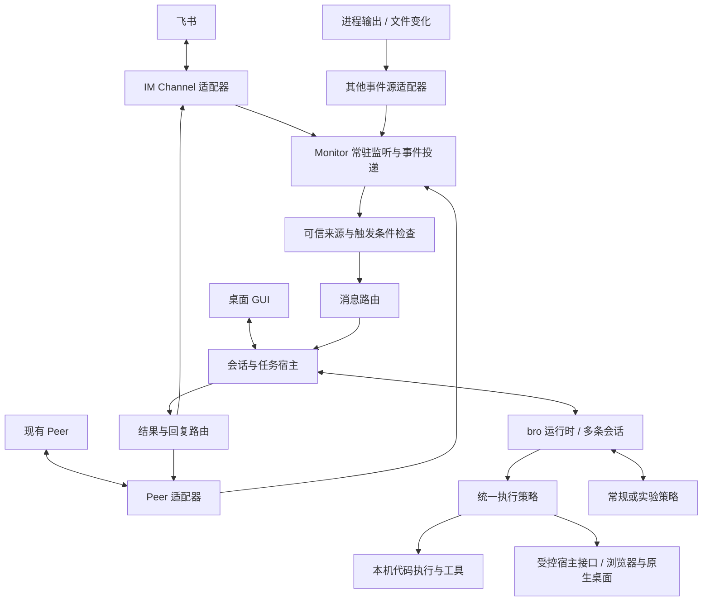

# bro 项目方案

状态：首版需求范围、主体架构及工具审批方式已确认；用户已授权编写 [实施方案](implementation.md)，尚未开始功能实现或运行验证。更新：2026-09-29。

项目仓库：[Donmagelas/bro](https://github.com/Donmagelas/bro)。项目资料和后续代码统一存放于此；按用户最新要求直接提交并推送到 `main`，不自动创建 PR。

## 问题与目标

项目名称为 **bro**。产品只有一个 Agent：bro；用户创建和使用的是不同会话，不创建多个命名 Agent 或角色配置。

构建有 GUI 的个人 Agent 工作台，覆盖用户所需的 Codex 本地工作能力，包括 Computer Use；提供独立于窗口存活的通用 Monitor，通过消息路由连接飞书、本机 Peer 等来源。首版 IM 只做飞书，微信接入暂缓。只有受信任的人可以使用，默认仅本人；名单内的人均可使用完整能力。IM 入口没有有效会话连接时自动新建并连接，之后一直复用；会话删除或归档后连接失效，下次有效消息重新走新建逻辑。受信任的人通过入口会话让 bro 查询电脑上的其他会话、向其他会话发送消息。群聊按“连接/Bot + 群 + 成员”建立和续接会话，只有受信任的人 @ 才触发处理与回复。

在 Skill 选择、上下文选择与压缩环节支持常规实现与实验实现切换。

Codex 本地能力是对照来源，实际范围以用户逐项取舍为准，不再以“Codex 有的全部照搬”描述交付。已经明确不要或暂缓的能力不会因底座自带而进入首版；保留能力仍需逐项验收，不能用聊天成功、工具注册或 UI 展示代替。Codex 官方托管连接器及云端执行服务不在范围内。

bro 还应能与本机 Codex 桌面端的指定会话对话，包括查找会话、发送用户交办的消息、读取回复并向来源回报。这属于外部应用操作，不是把 Codex 会话改成 bro 内部会话；需要独立验证真实桌面端的收发与状态关联。

用户已明确将执行沙箱延后为未来增强项；当前版本按本机直接执行设计，不以沙箱选型、接入或验收作为交付前提。

## 范围与非目标

### 已确认范围

| 能力域 | 范围 |
| --- | --- |
| GUI | 首版同时支持 macOS 与 Windows；项目、会话、运行状态、文本/图片/文件结果入口、基础 diff、对话文字批注、Monitor 与路由配置、实验配置；复杂文件预览和高级 diff 交互暂缓，没有多 Agent 创建或选择界面 |
| 会话 | 历史、恢复、分支、上下文压缩；GUI 提供手动终止、排队发送与 steer，非 GUI 消息统一排队；bro 可按授权查询其他会话并向其发消息 |
| 开发工作 | 文件、终端、测试、Git、worktree、审查与 PR 工作流；保留 OMP Hashline/AST、LSP、DAP、持久 Python/JavaScript 工具能力，不另建 IDE 界面 |
| 执行 | 多步骤任务、并行工作、后台任务、失败处理；原能力基线中的子代理属于内部执行能力，不引入多个用户可配置的 Agent 身份 |
| 模型接入 | 必须同时支持 ChatGPT 账号登录与 API Key + 自定义 Base URL；GUI 提供连接配置、模型选择、推理强度、上下文用量、费用及登录状态；高级模型角色/自动切换/凭据轮换不增加专门界面 |
| 工具资源 | Skills、MCP、自定义工具、网页检索、图片与文档处理；复用 OMP 本地/Git 插件安装配置，GUI 提供查看、启停、更新、卸载；不自建商店或承诺全部 Codex 插件兼容 |
| Computer Use | 复用 OMP 的浏览器、控件操作与后台输入能力；bro 补上跨会话协调与 GUI 控制，覆盖已有登录态、状态读取、截图、交互及结果检查；包含操作 Codex 桌面端对话，Appshots 暂缓，Mac 锁屏操作只做非阻塞的可行性评估 |
| 持续工作 | 通用 Monitor、事件唤醒、任务通知；定时任务整体暂缓；常规记忆暂定复用 Mnemopi，GUI 提供 on/off；保留正常上下文能力 |
| 消息接入 | 首版 IM 仅飞书，保留本机 Peer 等通用 Monitor 来源；没有有效会话连接时自动新建，之后复用，删除/归档后连接失效；结果返回来源，群聊按群与成员分配会话 |
| 接入 | 受信任的人名单，默认仅本人；名单内同等完整能力，名单外不能使用 |
| 实验 | Skill 选择；上下文选择与压缩。关闭实验时常规能力完整可用 |

### 当前功能基线草案

下表汇总已讨论的基础能力，本节后的功能取舍表限定其范围。它不是“已逐项核实 Codex 所有功能”的声明，也不代表任何一项已经实现。上轮对照中的新增建议若未获确认，仍属于候选，不因本轮只批注部分条目而全部自动纳入。

| 能力域 | 当前基线 |
| --- | --- |
| 项目与会话 | 一个项目对应一个目录，多文件夹暂缓；普通聊天和飞书首次自动创建的会话使用 bro 默认工作目录；保留新建、搜索、恢复、分支、归档、重命名、置顶，显示运行/排队状态；GUI 明确选择终止、排队或 steer |
| 开发与结果 | 文件读取/修改/搜索、命令与测试、Git/worktree、基础 diff 和代码审查、PR 工作流；展示文本、图片、文件链接和工具结果，支持对话文字批注；复杂文档内嵌预览、高级 diff 选择/批注/暂存/撤销暂缓，仍可用实际文件及工具检查产物 |
| 模型与资源 | GUI 支持 ChatGPT 账号登录、API Key + 自定义 Base URL、模型名称/ID 与选择；管理 Skills、MCP 和自定义工具；提供正常的网页检索、图片与文档处理路径 |
| 后台执行 | 多步骤任务、并发会话与内部临时子代理；窗口关闭后继续工作；持久队列、状态恢复、失败反馈及用户接管；不提供 Plan、Goal 或 Vibe 模式 |
| Computer Use | macOS/Windows 各自完成浏览器及原生应用检查、截图、交互和结果验证；管理连接、系统权限、已有登录态与桌面争用；在 Codex 桌面端指定会话收发消息，验证外部任务关联 |
| Monitor 与路由 | 飞书、Peer、进程输出/文件变化事件；接入与可信身份检查、去重重连、目标会话绑定、非 GUI 统一排队及按来源回复；微信和定时任务延后 |
| 跨会话协作 | 查询状态和记录、向目标会话排队交办、保持入口可用、异步结果通知；来源与任务关联不串线 |
| 群聊 | 受信任者 @ 才触发；按群与成员续接；默认仅本次 @、引用和成员会话，按需查群记录；目标会话删除/归档视为无连接，下次有效 @ 新建 |
| 常规与实验 | 常规记忆、上下文管理与压缩；Skill 选择、上下文选择和压缩策略各自切换、旁路比较、失败回退及恢复默认行为 |
| 双平台交付 | macOS/Windows 安装启动、后台生命周期和设置持久化分别验收；不以单端演示替代另一端支持 |

### 功能对照后的取舍（2026-09-29）

以下为用户在 Codex/OMP 对照后的最新决定，覆盖上轮建议。不要、暂缓与非强制探索分别记录，不将“暂缓”改成首版隐藏或默认关闭但仍需交付的模块。

| 条目 | 当前决定与边界 |
| --- | --- |
| Plan 模式 | 不需要，不设专用模式或自动切入该模式；普通对话仍可讨论需求、提供建议，不因没有 Plan 模式而自行进入实现 |
| Goal 模式 | 不需要，不增加持久目标模式及其专用控制；普通多步骤任务、长命令、后台执行、Monitor 和任务通知保留 |
| 临时侧聊 | 暂缓；已确认的多会话及跨会话查询/交办保留 |
| 高级 diff 工作台 | 暂缓分支/未提交/单次修改等范围切换、逐行批注、按文件或片段暂存/撤销的 GUI 增强；基础 diff、Git/worktree 和代码审查能力保留 |
| 内置共享浏览器工作台 | 暂缓 GUI 内共享页面、本地应用嵌入预览、页面元素/区域批注；OMP 浏览器自动化和已有登录态接入方向保留 |
| 复杂文件预览 | 暂缓 PDF、文档、表格、幻灯片、HTML 的专用内嵌预览；文件读写/生成、实际产物检查及文件入口保留 |
| 批注 | 保留。首版按用户当前使用方式支持选中对话回复文字并附意见，随后提交给 bro；范围说明见“对话批注”。网页、复杂文件预览及高级 diff 上的批注随相应界面暂缓 |
| OMP 附加能力 | Advisor/Watchdog、TTSR、checkpoint/rewind、Snapcompact、learn/managed skills、多来源规则兼容、Collab、Vibe、Magic keywords、ACP、IDA、专用 Security Scan、TTS 全部暂缓 |
| 不纳入的附加入口与展示 | 实时语音对话/语音指挥、交互式图表/HTML 可视化、浏览器侧栏聊天、IDE 双向上下文、宠物/迷你悬浮界面、手机原生客户端及远程桌面式控制不需要 |
| Appshots | 暂缓：首版不提供主动捕获前台应用窗口及可取得文本并附入会话的专用入口；Computer Use 自身的截图与状态读取能力保留 |
| Mac 锁屏后的 Computer Use | 可以评估能否实现，不强求，不作为首版交付门槛；不承诺常驻后台就能实现锁屏操作 |
| 与 Codex 桌面端对话 | 纳入 Computer Use 的明确使用场景；要求操作真实指定会话并读回结果，不能以调用同一个模型或读取会话日志代替 |
| 默认工作目录 | 飞书首次创建的会话及普通聊天使用 bro 默认工作目录；处理项目时明确指定项目或交办已有会话，不跟随 GUI 当前打开的项目 |
| 归档与删除 | 两者均解除入口绑定，下次有效消息按无连接逻辑新建；不考虑运行中归档/删除的特殊处理，不为该情形增设需求、测试或追问 |
| 定时任务 | 整体暂缓，包括计划触发、每次新建会话、任务日程管理与定时运行记录；事件驱动的 Monitor、普通后台任务及结果通知保留 |
| Skills/MCP/插件管理 | 复用 OMP 本地/Git 安装与配置，GUI 支持查看、启停、更新、卸载；不自建插件商店，不承诺兼容全部 Codex 插件 |
| OMP 开发工具 | 保留 Hashline/AST、LSP、DAP、持久 Python/JS 执行环境为工具能力，不额外做一套 IDE 界面 |
| 模型设置 | 保留模型、推理强度、上下文用量与费用显示；模型角色、自动切换、多凭据轮换不增加专门界面，不能据此静默改变已选计费路径 |
| 项目/会话组织 | 重命名与置顶保留；首版一个项目对应一个目录，多文件夹暂缓；普通聊天使用默认工作目录 |
| 工具审批 | 沿用 OMP 默认 `yolo`，不增加 bro 的逐工具确认；系统权限、工具显式的禁止/确认规则及用户指令仍然有效 |

暂缓 `learn/managed skills` 不影响 Mnemopi 原有自动积累；暂缓多来源规则兼容不取消 bro 自身的项目规则和 Skills；暂缓专用 Security Scan 不取消普通代码安全审查。普通内部临时子代理也不因 Vibe/Collab 暂缓而取消。

常规运行基线是按以上取舍配置后的 OMP 能力集合，而不是不加选择地继承全部上游开关、命令和自动发现行为。关闭 Skill/上下文实验应恢复这套常规基线，不能顺便启用暂缓能力。

项目组织、资源管理、OMP 开发工具和模型设置范围已收敛；定时任务整体暂缓。工具审批已确认沿用 OMP 默认 `yolo`，不另加 bro 审批层。剩余事项为技术验证与非强制探索，不要求用户预选底层实现；开发顺序与验证步骤统一记录于实施方案。

### 明确排除

- Codex 官方托管连接器、官方云端任务和云端执行服务；不建设离线云端接管或离线收件 Hub。
- 多 Agent 身份、角色商店或按 Agent 分配 IM 入口；产品统一使用 bro，区分会话即可。
- admin/user 分级、只读成员与按人划分的会话/项目可见范围；统一采用受信任的人名单。
- 当前实验范围不扩展到 IM 路由、模型路由、工具重试、权限判断、执行结束判断等其他环节。
- 当前版本不做执行沙箱；保留为后续增强项，不启动相关选型验证、移植或集成。
- 首版 IM 只做飞书，微信私聊与群聊均暂缓；保留调研资料供以后接入。
- Plan、Goal 及上述明确不要的附加入口/展示不纳入；Appshots、侧聊、复杂预览、高级 diff 工作台、内置共享浏览器工作台及 OMP 附加模块按功能取舍表暂缓。
- 定时任务及多文件夹项目暂缓；不建设独立 IDE 界面或插件商店，不设计运行中删除/归档会话的特殊分支。
- 当前交付为需求方案、实施方案与仓库基础文件，不包含功能编码或安装；用户已授权将项目内容提交至指定 GitHub 仓库。

排除 Codex 官方托管服务不等于排除 ChatGPT 账号登录、飞书官方 API、后续选定的微信接入接口、用户配置的 MCP 或模型 API。

## 约束与已知事实

### 用户已确认

- 项目名为 bro；Agent 只有一个，不同的只是会话。
- 必须有 GUI。
- GUI 的视觉风格和排版参考用户正在使用的 Codex 桌面版；按 bro 已确认的功能范围呈现，不因参考界面而恢复已排除或暂缓的功能。
- 首版同时支持 macOS 和 Windows；两端的 GUI、后台服务及 Computer Use 均纳入首版范围。Linux 不列入首版。
- 模型接入必须同时支持 ChatGPT 账号登录与 API Key + 自定义 Base URL；优先复用 pi/OMP 已有认证和模型调用能力，并接入 bro GUI。
- Monitor 是通用能力，来源包括但不限于 IM 与 Peer，独立于聊天窗口。
- 路由决定消息进入 bro 的哪条会话；不能把所有来源自动并入当前桌面会话。
- 飞书 Bot 可以连接 bro 的一条会话；这条会话里的 bro 能按用户要求查询其他会话、向其他会话发消息。
- 跨会话任务默认先确认交办，入口会话保持可聊天，目标任务完成后再通知；不等待目标完成才释放入口会话。
- GUI 由用户手动选择终止、排队发送或 steer，不采用模型自动分类后给消息贴“补充要求/后续任务/停止”标签的交互。用户已纠正先前的 query 表述，实际指 steer。
- 非 GUI 来源的消息统一排队发送，包括 IM、Peer 和其他 Monitor 来源；不根据正文自动切换为 steer 或立即停止。
- 只有受信任的人可以使用 bro，默认仅本人。受信任的人私聊可直接触发；群聊只有受信任的人 @ bro/Bot 才触发处理与回复。该成员在该群首次有效 @ 时创建会话，后续有效 @ 续接会话。
- 群请求默认上下文为本次 @、引用内容和该成员已有会话；需要时再查询群记录，不自动附带最近一段未 @ 的群聊。
- 会话连接使用统一规则：没有有效连接时新建一个会话并绑定，之后一直复用；所连接的会话被删除或归档后视为无连接，下次有效消息再新建。群聊仍按“连接/Bot + 群 + 成员”分别判断。
- 受信任的人均可执行完整行为，包括查看、修改文件、运行命令、Computer Use、跨会话操作与修改配置；不再区分 admin/user，也不保留只读成员或按人的可见范围配置。既有全局规则继续生效。
- 当前先不做沙箱，执行直接使用本机运行账号的系统权限；沙箱作为以后增强项。工具审批已另行确认采用 OMP 默认 `yolo`，不额外逐工具确认；受信任名单、任务控制和来源记录保持。
- 微信暂缓，首版 IM 只做飞书；未来恢复微信接入时仍以个人微信方向为既有讨论背景，具体范围届时确定。本机 Peer 等通用 Monitor 来源不因此移除。
- 任务应持续执行；机器通常一直开着，不继续扩大离线与关机处理范围。
- 合盖仍需执行时，运行环境必须保持系统实际运行。普通后台进程不能在系统休眠中继续执行；合盖供电和唤醒条件作为部署验收条件，不通过增加云端架构解决。
- 整体架构已确定为 OMP SDK + Electron GUI + 独立 Bun 后台宿主；宿主按需启动独立的 OMP 会话运行进程。历史会话无需始终占用进程，实际资源回收方式通过验证确定。
- 安装包包含匹配的 Bun 运行时、OMP 依赖与原生模块；用户安装 bro 后配置模型、飞书连接及系统权限。
- Computer Use 已确定复用 OMP 的浏览器、控件操作与后台输入能力，由 bro 补上跨会话协调和 GUI 控制；与整个已确认架构一起完成后续兼容性验证。
- bro 使用本机桌面期间，检测到本人的鼠标/键盘输入后自动暂停该桌面的自动操作，等待本人手动点击继续；不因一段时间没有输入而自动恢复。其他独立会话与后台任务可以继续，恢复前重新检查窗口和页面状态。
- 实验功能可插拔、可关闭、可切回常规实现，不成为基本功能的必需依赖。
- 长期记忆直接复用 OMP 已有模块及所选后端的现成行为。用户已撤回“明确要求记住才写入”的限制；自动积累、读取与整理按所选后端正常机制运行，不另建显式写入门槛。
- 用户已暂定采用 Mnemopi，并要求可以 on/off。bro 衔接现有记忆模块、GUI 开关与会话作用域；`local`、`hindsight`、`sharpshooter` 保留为其他现有方案的比较资料，不作为首版额外接入要求。
- bro 仓库按用户最新要求直接提交并推送到 `main`，不自动创建 PR。若以后明确要求创建 PR，则保持 Draft 直至明确授权 Ready，仍不代用户合并或启用自动合并。实验模块不能覆盖这些约束。
- 用户已完成一轮功能减法，范围以“功能对照后的取舍”表为准；Appshots 已改为暂缓，对话批注和在 Codex 桌面端对话保留，锁屏 Computer Use 仅作非强制可行性探索。
- 用户已明确授权编写实施方案；本次仅规划，不自动开始功能编码或安装。
- 新建飞书入口会话与普通聊天使用 bro 默认工作目录；一个项目一个目录；重命名/置顶、OMP 本地/Git 插件管理、开发工具和模型用量设置按最新取舍保留。定时任务整体暂缓，归档和删除均解除入口绑定，不再讨论运行中操作的特殊情况。

### 已核实的事实与证据边界

- 2026-09-29 阅读 [Codex App Server 官方文档](https://developers.openai.com/codex/app-server)：公开协议提供 `thread/list`、`thread/read`、`thread/resume`、`turn/start`、`turn/steer` 等会话接口；这是协议能力证据，不证明可直接连上当前桌面 App 已使用的运行实例、接管活跃会话或同步其 GUI。尚未连接、发送测试消息或修改 Codex 会话。
- 同轮读取 [Appshots](https://learn.chatgpt.com/codex/appshots) 与 [Computer Use](https://learn.chatgpt.com/codex/computer-use) 官方说明：Appshots 可包含前台窗口截图和可访问文本；Mac Locked use 使用额外的授权插件。后者不是普通后台常驻能力，当前只记录可行性问题。OMP [computer 文档](https://github.com/can1357/oh-my-pi/blob/d1932a6ff85613dde1160b87a73ddcdc3beb01f6/docs/tools/computer.md)有操作原生应用/IDE 的接口，但尚未证明在 Codex 桌面端及锁屏状态下的实际收发行为。
- 曾读取本机旧 Monitor 项目的 `src/events.mjs`：启动 `lark-cli event consume im.message.receive_v1 --as bot`，读取逐行 JSON，再交给桥接逻辑。该项目不在本仓库中。
- 同一旧项目的 `src/bridge.mjs` 按 `chat_id` 续接独立 Claude 会话，包含去重、排队和控制消息处理。它没有实现 bro 所需的跨会话操作和“群 + 成员”路由。
- 曾读取本机 Peer relay 的 `bin/peer-sub.mjs`：使用 SSE 接收记录，维护游标、重连和补投排序，并将事件渲染到 stdout；其 `bin/peer-send.mjs` 支持关联回复。该组件不在本仓库中，后续接入时再核实实际部署状态。
- 以下微信调研仅作为后续接入参考，当前不继续选型或验证：2026-09-29 读取了腾讯 [openclaw-weixin](https://github.com/Tencent/openclaw-weixin) 的 README、协议和通道源码，[协议](https://github.com/Tencent/openclaw-weixin/blob/main/docs/protocol.md)提供扫码连接、HTTPS JSON、`getUpdates` 长轮询和 `sendMessage` 回复，默认服务为 `ilinkai.weixin.qq.com`；代码为 MIT 许可，未来可评估复用通信部分并适配 bro 的 Monitor/路由。
- 该通道当前 [capabilities](https://github.com/Tencent/openclaw-weixin/blob/main/src/channel.ts) 仅声明 `chatTypes: ["direct"]`。类型里的 `group_id` 不证明已支持微信群；也不能把这个 Bot 通道当成读取本人微信账号全部好友/群消息的接口。尚未安装插件、扫码登录或进行实际收发验证。
- 微信回复使用入站 `context_token` 等关联，引用消息可能依赖本地引用缓存；未来选型需验证图片/文件、引用内容、重启恢复和长任务完成后的回复，不只验证即时文本。直接复用插件需依赖 OpenClaw；已有候选方向是独立适配其通信实现，不引入第二套 Agent 产品，当前不实施。
- 以上来自前面讨论时读取源代码的证据，没有启动、改动现有服务或验证当前连接状态。
- [pi SDK](https://github.com/earendil-works/pi/blob/main/packages/coding-agent/docs/sdk.md)提供会话和资源控制；[扩展接口](https://github.com/earendil-works/pi/blob/main/packages/coding-agent/docs/extensions.md)提供上下文和执行事件挂钩。接口是否足够覆盖本方案仍需针对性验证。
- 2026-09-29 核对 pi 提交 `4259686d9290c0d73ae7192b796aee3e530a9779` 的 [OpenAI OAuth 实现](https://github.com/earendil-works/pi/blob/4259686d9290c0d73ae7192b796aee3e530a9779/packages/ai/src/auth/oauth/openai-codex.ts)：已有 ChatGPT 订阅登录、浏览器授权、设备码路径和令牌刷新。[模型文档](https://github.com/earendil-works/pi/blob/main/packages/coding-agent/docs/models.md)支持在 `models.json` 配置 `baseUrl`、`apiKey`、API 协议与模型 ID。
- 同日核对 OMP [Providers](https://github.com/can1357/oh-my-pi/blob/main/docs/providers.md) 与 [Models](https://github.com/can1357/oh-my-pi/blob/main/docs/models.md)：已有 `/login`、ChatGPT/Codex OAuth 与凭据刷新，也支持在 `models.yml` 配置自定义 Base URL、API Key、协议和模型。两种底座均有可复用能力；尚未执行真实登录、请求或 bro GUI 集成验收。
- [OpenAI 官方认证文档](https://learn.chatgpt.com/docs/auth)区分 ChatGPT 订阅登录与 API Key 按量使用。具体模型和额度取决于账号、计划或所配置的 API 服务；支持登录不等于任意账号都可访问所有模型，也不把订阅凭据自动当作第三方网关 API Key。
- [OMP TypeSafe 接口](https://github.com/can1357/oh-my-pi/blob/main/packages/ai/src/judgment/typesafe.ts)已实现结构化判断接入；社区存在 Laya 插件。这是可复用性的线索，不是本项目的运行或质量验收。
- 2026-09-29 针对 [OMP 提交 d1932a6](https://github.com/can1357/oh-my-pi/tree/d1932a6ff85613dde1160b87a73ddcdc3beb01f6)进一步静态核对：SDK 提供 `createAgentSession` 与启动时 `skills` 注入；会话有 `steer`、`followUp`、`abort`；扩展提供 `before_agent_start`、`context`、`session_before_compact` 等接口。支持是接口证据，不等于 bro 端到端功能已验证。
- 同日进一步核对该版本 [coding-agent 包配置](https://github.com/can1357/oh-my-pi/blob/d1932a6ff85613dde1160b87a73ddcdc3beb01f6/packages/coding-agent/package.json)、natives 包配置和 [SDK 源码](https://github.com/can1357/oh-my-pi/blob/d1932a6ff85613dde1160b87a73ddcdc3beb01f6/packages/coding-agent/src/sdk.ts)：两个包均声明 Bun 引擎，SDK 使用 Bun API；根包包管理器要求与子包最低引擎版本也不同，打包时需统一固定兼容版本。SDK 有进程级设置绑定、`AsyncJobManager` 单例和活跃资源快照；私有 `AgentRegistry` 并不覆盖全部共享状态。独立 Bun 运行进程因此是当前推荐，尚未进行构建或嵌入验证。
- 该版本 [Computer Use 文档](https://github.com/can1357/oh-my-pi/blob/d1932a6ff85613dde1160b87a73ddcdc3beb01f6/docs/computer-use.md)列出 macOS 截图/AX/输入和 Windows 截图/Win32 输入/UI Automation；功能默认关闭，需要启用并在真实平台检查能力与系统权限。尚未验证两端运行。
- 同日进一步核对该版本桌面文档、`computer.ts`、worker 与 macOS/Windows 原生输入实现：`computer` 通过 Eval 的 JavaScript/Python 接口调用持久桌面 worker，支持窗口/显示器枚举、截图、系统无障碍控件、键鼠与剪贴板。窗口输入默认尝试后台投递；不支持时报告 `BackgroundUnavailable`，可改用无障碍动作或显式 `takeover: true` 临时激活目标。桌面根级坐标输入直接使用真实鼠标，后台支持取决于应用与平台。
- OMP 的 takeover 指 Agent 临时取得前台输入；已有焦点恢复保护，Windows 输入批次还会检查目标是否仍在前台。这不等于“任何真人鼠标/键盘输入都暂停 Agent，等待手动继续”。所查接口未见后一套完整行为。`createComputerPrelude` 为会话建立 controller，单个 worker 遇到并发 run 会返回 busy；不能将其直接当作 bro 多会话共享桌面的全局任务队列。
- OMP [Browser 文档](https://github.com/can1357/oh-my-pi/blob/d1932a6ff85613dde1160b87a73ddcdc3beb01f6/docs/tools/browser.md)另提供 DOM/ARIA、选择器、页面 JavaScript、截图、表单及上传等路径；支持自建 Chromium、CDP 连接和经 relay/扩展连接真实 Chrome 标签页。复用已有登录态依赖选定连接方式，不会自动取得所有浏览器会话。以上仍为文档和代码核对，未进行本机桌面或浏览器实操。
- 同日读取该版本 [Memory 文档](https://github.com/can1357/oh-my-pi/blob/d1932a6ff85613dde1160b87a73ddcdc3beb01f6/docs/memory.md)：记忆默认关闭，已有 `local`、`mnemopi` 等可选后端。`local` 从持久化会话提取并合并项目记忆，产生摘要、长期记忆文档及流程文件，新会话可注入项目摘要和经验；默认后台管线在启动时运行，并跳过活跃或过近的会话。这是可复用的候选能力，不等于 bro 常驻服务已具备及时提炼机制。
- 各记忆后端的读写与删除能力不同：该版本 [memory_edit 文档](https://github.com/can1357/oh-my-pi/blob/d1932a6ff85613dde1160b87a73ddcdc3beb01f6/docs/tools/memory_edit.md)仅为 Mnemopi 提供此工具，且不同记录类型支持的操作不同。不能把某个后端的编辑能力当成所有后端通用；当前未启用记忆后端或修改本机记忆数据。
- 进一步核对 [Mnemopi 文档](https://github.com/can1357/oh-my-pi/blob/d1932a6ff85613dde1160b87a73ddcdc3beb01f6/docs/mnemosyne-memory-backend.md)、`mnemopi/settings.ts` 与 [`mnemopi/state.ts`](https://github.com/can1357/oh-my-pi/blob/d1932a6ff85613dde1160b87a73ddcdc3beb01f6/packages/coding-agent/src/mnemopi/state.ts)：已有本地 SQLite、项目/全局作用域、`retain`、`recall`、`reflect` 和受记录类型约束的编辑接口。`autoRetain` 与 `autoRecall` 默认均为 true，独立配置；任务结束按轮次节奏自动保留，正常退出尊重自动保留设置。bro 不再因先前已撤回的要求关闭这些正常路径。
- [Sharpshooter 提取提示词](https://github.com/can1357/oh-my-pi/blob/d1932a6ff85613dde1160b87a73ddcdc3beb01f6/packages/coding-agent/src/prompts/memories/sharpshooter-extract-system.md)与其 backend/paths 源码显示：从用户项目决策、纠正、回归反馈等提取候选，后续按纠正、回归或隐含约束等信号筛选整理，保存为项目作用域的 `architecture.md`、`product.md`、`style.md`。这是一种聚焦项目决策的记忆后端，与通用会话记忆的用途不同。
- 该版本 [压缩文档](https://github.com/can1357/oh-my-pi/blob/d1932a6ff85613dde1160b87a73ddcdc3beb01f6/docs/compaction.md)说明：注册 `session_before_compact` 后会跳过 speculative compaction（提前在后台计算摘要）。因此实验关闭、旁路比较与原生压缩恢复需要专门设计，不能把注册后直接返回当成默认行为完全不变。
- pi 当前 SDK 同样支持嵌入、会话恢复、steer/follow-up 与资源加载器，扩展有上下文变换接口。OMP 启动时 `skills` 注入不等于已经验证按每个请求动态选择 Skill；两者的实验接口都还需要定向验证。
- [Jev](https://docs.typesafe.ai/primitives)提供 Choice、Score、Noul 等判断结果；当前[模型文档](https://docs.typesafe.ai/models)列为文本输入。[Laya](https://github.com/NandhaKishorM/laya)提供本地模型和同类接口，其语言、上下文长度及准确率不能直接视为与 Jev 等价。
- 2026-09-29 读取的 [pi 安全文档](https://github.com/earendil-works/pi/blob/main/packages/coding-agent/docs/security.md)明确说明没有内置操作系统沙箱，默认继承启动账号权限；工作目录和项目信任不是文件、网络隔离边界。扩展在 pi 进程中执行，只包住内置工具不能覆盖其他扩展。
- [pi 隔离指南](https://github.com/earendil-works/pi/blob/main/packages/coding-agent/docs/containerization.md)列出整进程容器/沙箱运行和仅隔离内置工具等方案；保护范围取决于挂载、网络、凭据和哪些进程实际处于边界内。
- [OMP 工具审批](https://github.com/can1357/oh-my-pi/blob/main/docs/approval-mode.md)提供 read/write/exec 分级与 allow/deny/prompt 策略。这证明有调用审批能力，不能据此认定安装 OMP 就具备与 Codex 相同的操作系统隔离。读取到的任务工作区隔离和 robomp 部署隔离也不能自动等同于本机 GUI 运行时沙箱。
- [sandbox-runtime](https://github.com/anthropic-experimental/sandbox-runtime)提供 macOS Seatbelt、Linux bubblewrap 和网络代理等可复用实现，是待验证候选。其默认允许广泛读取，bro 仍须配置读取边界；仅封装命令不会自动隔离宿主扩展、桌面工具或其他 MCP 服务。
- Codex 官方安全文档页面访问遇到 403/重定向；后续直接核对了开源仓库 [openai/codex，提交 c248f6d](https://github.com/openai/codex/tree/c248f6d48b97eb4a2aa56147a0b11b7d763278b9)。其 [LICENSE](https://github.com/openai/codex/blob/c248f6d48b97eb4a2aa56147a0b11b7d763278b9/LICENSE) 为 Apache-2.0，允许在满足许可证、声明保留和修改标注等条件下复用与分发；分发时还需处理适用的 NOTICE 和依赖许可。
- 该提交已有 [codex-sandboxing](https://github.com/openai/codex/tree/c248f6d48b97eb4a2aa56147a0b11b7d763278b9/codex-rs/sandboxing) Rust 模块及 `codex sandbox` 普通命令执行入口。macOS 使用 Seatbelt / `/usr/bin/sandbox-exec`，Linux 默认采用 bubblewrap 并配合其他系统限制；另有 Windows 实现。模块依赖仓库内的协议、网络代理和工具库，不是可直接嵌入 pi 的独立 TypeScript 包。
- 上述为开源执行与沙箱代码的静态核对，不等同于已验证 bro 的整条执行路径，也不代表已核对桌面 App 的所有内部机制。没有安装、构建或运行这些沙箱候选。

## 候选方案与权衡

| 底座 | 优势 | 主要成本 | 选定前需要核实 |
| --- | --- | --- | --- |
| pi SDK + 自建工作台与常驻服务 | 核心精简，会话、资源和上下文控制边界较清楚 | 工具、工作流及 GUI 需要补得更多 | Skill 选择与压缩是否可完整替换，能否稳定嵌入后台服务 |
| OMP SDK/运行时 + 自建工作台与常驻服务 | 已有较多工具、子代理和判断能力 | 适应其内部结构，承担上游更新与兼容维护 | GUI 宿主、Monitor 投递、两类实验接口和默认行为隔离是否足够 |

建议保持工作台、Monitor、路由与具体执行底座分离，通过有限的宿主接口连接。先用实际需要的两个实验位置检验候选底座，不为了抽象可扩展性提前重写整个 Agent 执行循环。

结合首版 macOS + Windows、Computer Use 和较完整的本地工作能力，已选择 **OMP SDK** 作为主方案。pi SDK 保留为具体不兼容问题出现时的备选。优先验证项为多条会话的后台运行与恢复、消息投递和取消、每个请求的 Skill 选择、上下文/压缩替换及恢复默认行为、两端 Computer Use。OMP SDK 的进程级共享状态促成了按需启动独立会话运行进程的选择。

首版平台已确定为 macOS + Windows，GUI 已选择 Electron。以下保留选型比较：

| 方向 | 优势 | 主要成本 |
| --- | --- | --- |
| Electron | 已选定；两端可共享主要界面代码，便于衔接本机运行进程 | 安装体积和运行占用，后台进程与窗口生命周期仍需单独设计 |
| Tauri + 独立运行时 | 桌面壳有机会更轻，可复用 Web 界面 | pi/OMP 运行时仍需单独打包和通信，系统 WebView 差异及 Rust 接口增加维护面 |
| 两端原生 GUI | 平台交互可分别优化 | 要维护两套界面与桥接实现，不作为当前优先候选 |

Electron 与 OMP/Bun 独立运行进程的组合已确认。GUI 技术跨平台不代表 Computer Use 自动跨平台；浏览器及原生桌面适配必须在两个系统分别验证。

结合已确认复用的 Computer Use 和暂定 Mnemopi，整体架构已确认为 **OMP SDK + Electron GUI + 独立 Bun 后台宿主**。使用 pi SDK 作为主循环再移植这些 OMP 模块会增加适配面，因此 pi 保留为有明确不兼容证据时的备选，不作为首版同时维护的第二套运行时。

运行进程方案已选择按需独立会话进程，比较如下：

| 方向 | 收益 | 成本与选择条件 |
| --- | --- | --- |
| 一个 Bun 进程承载多条 OMP 顶层会话 | 运行进程较少，可能降低启动和内存开销 | 需要逐项证明设置、资源快照、后台任务及清理不串线；当前只有部分会话隔离接口证据 |
| 后台宿主管理独立的 OMP 会话运行进程 | 避免顶层会话直接共享进程级变量，缩小单个执行进程异常的影响 | 已选定按需启动；增加内存、启动和进程管理开销，后续通过资源测量确定回收方式 |

该进程划分属于稳定性设计，不是执行沙箱，也不增加产品中的 Agent 身份。会话存在不要求始终占用进程；仍有后台命令、内部子代理或其他执行资源的会话不能仅因模型暂时无输出就被回收。空闲回收策略与并发上限根据实际资源测量决定，无须用户提前选择数字。

微信已暂缓，首版 IM 仅飞书。未来恢复微信接入时可参考腾讯公开 Bot 通道的通信实现；当前开源通道只声明私聊能力，不能将其直接判定为支持微信群。

以下保留沙箱调研作为**后续增强参考**，当前不开展选型或验证：

| 方向 | 能满足什么 | 成本与限制 |
| --- | --- | --- |
| 仅工具审批 | 决定哪个请求能调用哪个工具 | 不能独立限制进程的文件与网络访问，不满足执行隔离目标 |
| 原生操作系统沙箱 + 受控宿主服务 | 保留本机开发环境，限制代码进程的读写与网络；桌面能力单独授权 | 恢复该增强时优先评估；须覆盖扩展、子进程与本地 MCP，并验证 macOS 行为和升级兼容 |
| 完整运行时放入容器/虚拟机 + 受控宿主服务 | 提供更独立的执行环境 | 工具链、文件同步、环境维护成本较高；访问真实桌面仍须跨越边界 |

未来恢复沙箱增强时，可优先评估复用 Codex 开源实现，sandbox-runtime 保留为对照候选。Codex 可通过 `codex sandbox` 子进程验证普通命令隔离，或把 `codex-sandboxing` 及必要依赖封装成 bro 的执行服务。前者减少移植但依赖 Codex 二进制与配置接口；后者更方便由 bro 管理策略，但需要 Rust 构建、打包与上游更新维护。二者都不要求使用 Codex 的模型规划循环。

未来若实施该增强，需把 pi/OMP 的实际文件操作、命令、子进程及本地 MCP/扩展执行接入对应边界，适配 bro 自身配置与凭据目录保护；仅将 bash 改为调用 `codex sandbox`，不能称为整个 bro 已受保护。真实桌面服务保持独立的宿主边界。当前不为这项增强提前引入专用执行服务、Rust 构建或容器依赖。

## 最终方案

本节记录已确认的总体结构：OMP SDK + Electron GUI + 独立 Bun 后台宿主，按需启动独立的 OMP 会话运行进程。关键兼容性验证尚未执行；微信与沙箱不在首版范围。

Computer Use 的复用方向已确认：OMP 提供浏览器、系统控件和后台窗口输入能力，bro 的宿主负责跨会话资源协调，GUI 提供状态与操作入口。

后台宿主持有会话、任务和订阅的生命周期，GUI 负责观察与控制。关闭窗口不等于停止后台服务；显式停止服务需要单独操作。

### 运行边界与数据归属

| 部分 | 职责与数据 |
| --- | --- |
| Electron GUI | 项目/会话界面、结果与 diff 展示、设置、queue/steer/stop 和桌面接管入口；通过本机接口订阅状态 |
| 独立后台宿主 | Monitor、可信来源检查、入口绑定、持久消息队列、跨会话请求及回复关联、运行进程管理、共享桌面协调；这些状态以宿主持久记录为准 |
| OMP 会话运行进程 | 通过 SDK 恢复对应会话，执行模型与工具循环，使用 OMP 会话历史和产物记录；承载该会话的 Skill/上下文实验适配 |
| 复用模块 | OMP 浏览器和桌面能力；暂定 Mnemopi 的记忆存储及检索；后台宿主把它们接入统一设置与必要的资源协调 |

建议保持如下接口边界：

- GUI 关闭后，后台宿主、Monitor 和正在运行的会话继续工作；GUI 重开时恢复订阅，不重建一份相互竞争的队列。运行在当前用户环境中，桌面执行仍依赖该用户可操作的桌面会话。
- 宿主保存任务投递与来源关联，OMP 保存原有会话内容；宿主可建立会话索引，但不平行维护另一套权威聊天历史。实际 OMP 会话恢复与宿主状态之间的映射需要验证。
- 所有外部来源先经宿主持久队列再投递 OMP；GUI steer/stop 使用已确认的独立控制路径。运行进程退出后由宿主记录中断，保留待投递消息；副作用不明的任务沿用既定规则，不盲目重跑。
- 两条会话使用独立进程仍可能操作同一目录、数据库或桌面；共享资源继续由对应模块协调。Computer Use 的桌面占用及用户接管状态属于宿主，不能只依赖各 worker 的 busy 状态。
- 实验优先通过 OMP 扩展和 SDK 接口接入；必要的上游适配集中在薄层，保持固定版本与升级检查。此处限定集成边界，具体步骤见实施方案。

安装交付已确定由 bro 包含兼容的 Bun 运行时、OMP 依赖和本机原生模块，用户安装桌面应用后即可进入配置流程；模型账号、飞书连接及系统权限仍按其正常流程配置。macOS 和 Windows 分别验证打包、后台启动和原生模块加载，不能把 Electron 构建通过视为 OMP 全链路运行成功。

## 关键行为与接口

### Channel、Monitor 与路由的分工

- **Channel/来源适配器**：连接具体平台或协议，完成认证、订阅、收发消息、附件和平台会话信息转换。不是所有平台都使用相同协议，也不假定微信与飞书拥有同等开放接口。
- **Monitor**：管理订阅生命周期、健康状态、重连和事件投递，首版支持 IM、SSE、进程 stdout、文件变化。数据源没有事件时不调用模型；定时任务整体暂缓，不以定时适配器名义重新纳入。
- **接入检查**：在创建/唤醒会话及调用模型前验证可信来源；IM 检查实际发送者是否在受信任名单，群聊另检查实际 @ 对象。不在名单的人即使私聊或 @ 也不触发。
- **消息路由**：将已接收事件映射到 bro 的项目、会话和投递方式。Monitor 不从正文猜测来源或目标身份。
- **运行宿主**：管理持久消息队列，空闲时取出处理，忙碌时保留排队消息；处理 GUI 明确选择的终止及 steer，不从非 GUI 消息正文推断投递模式。
- **回复路由**：使用入站来源和关联标识，将对应结果送回原私聊、群聊、话题或 Peer；跨来源转发需有明确配置。

Monitor 与官方 Channel 不是互斥的两种 IM 协议。Monitor 可以监听调用官方 API 的适配器输出，底层连接仍是平台的 WebSocket、Webhook 或其他接口。若来源实际采用轮询或 UI 抓取，那是适配器实现的差异；Monitor 不自动赋予平台消息权限或群聊能力。

### 路由与会话模型

本节以用户最新说明为准：bro 只有一个 Agent，产品模型围绕项目、会话和消息入口。先前提出的多个命名 Agent、每群共用一条会话、回复 Bot 即触发等建议已撤回。

#### 核心对象

| 概念 | 用途 |
| --- | --- |
| bro | 唯一的 Agent，具备统一的工作能力与全局设置 |
| 项目 | 工作目录、项目规则、项目资源 |
| 会话 | 对话、工具结果、待办、上下文与执行状态；不同会话可以分别工作 |
| 消息入口 | GUI、飞书 Bot 私聊、飞书群聊或 Peer 来源；微信延后 |

没有 Agent 创建、角色选择或每个群配置 Agent 的流程。模型、工具或实验选项可以按需要具有全局/会话设置，这些差异不产生新的 Agent 身份。原能力基线中的临时子代理作为会话内部执行细节保留，不等同于产品中的多 Agent 身份，也不自动成为 IM 入口。

#### 入口与会话的连接生命周期

收到符合接入条件的新消息后，按对应入口查找会话连接：

| 连接状态 | 处理方式 |
| --- | --- |
| 没有连接 | 新建会话，保存连接，将消息排入新会话 |
| 已连接的会话存在且未删除、未归档 | 持续复用该会话，将消息排入原会话 |
| 已连接的会话被删除、归档或已不存在 | 视为没有连接，回到新建逻辑 |

私聊按对应私聊入口判断；群聊仍按“连接/Bot + 群 + 成员”判断，不能退化为全群共用一条会话。若入口已显式连接某条有效的已有会话，也按“有连接”复用。

首次自动创建的飞书会话使用 bro 默认工作目录，不继承 GUI 当前打开项目的目录。需要处理某个项目时明确指定项目，或通过已确认的跨会话工具交办给该项目的现有会话。普通聊天同样使用默认工作目录；已有绑定继续沿用目标会话的工作目录。

删除或归档时令会话连接失效，不在操作当下自动创建替代会话；下一次有效消息到达时才新建。归档保留旧会话记录，删除遵循删除行为，均不自动把旧历史带入新会话。这里失效的是入口到会话的绑定，不是飞书 Bot 的登录或平台连接。

在身份与 @ 条件检查通过后才运行新建逻辑；不受信任者、无效 @ 或服务重启不会单独创建会话。连接持久化；同一入口同时到达多条首次消息时，只创建并绑定一条会话。

归档和删除均解除入口绑定。用户已明确不考虑运行中归档/删除的情况，不额外设计停止任务、取消队列或迁移在途结果的特殊分支。普通消息与结果继续按既定来源关联处理；无需增加单独的“新建并连接此入口”产品流程。

#### IM 连接会话，再由该会话操作其他会话

例：本人的飞书私聊首次收到有效消息时，没有会话连接，bro 自动新建并连接 S0；如果此前已明确连接 S0，则直接复用。GUI 中另有 S1“修登录问题”、S2“整理研究资料”。

- 用户在飞书说“看看修登录问题那边进展如何”，输入进入 S0；S0 中的 bro 查询 S1 的状态和相关记录，再在 S0 中回答并回复飞书。
- 用户说“去那个会话告诉它先跑测试，别提交”，S0 中的 bro 向 S1 发送一条可追溯的消息；S1 沿自身已有上下文继续工作。
- 用户继续问 S2，不需要把 Bot 改绑到 S2。S0 可作为稳定的远程入口，按需查询和联系其他会话。
- S0 是普通 bro 会话加上 IM 连接及跨会话工具能力，不是第二个 Agent，也不强制每个 Bot 都有一种特殊会话类型。
- 不自动把 S1、S2 的整段历史复制到 S0；查询获得的状态或片段进入 S0 的上下文，保留来源引用。
- GUI 能打开同一条 S0，看到远程对话、跨会话查询与投递记录；S1 也能看到来自 S0 的消息。

底层宜提供会话列举/搜索、读取状态与相关记录、发送消息等宿主接口。由 bro 理解用户的自然语言要求并调用这些接口，Monitor 只负责收事件。日常不需要用鼠标模拟点击 GUI 来查询会话；Computer Use 仍用于实际桌面任务。具体接口名称尚未确定。

跨会话消息须保留来源会话、实际请求者、目标会话与请求关联，不伪装成目标会话中本机用户新发的原始消息。受信任的人均可跨会话查询和操作；转发或引用内容不能伪造实际请求者或绕过接入检查。

“已进入目标会话队列”“目标会话已开始处理”“处理完成”分别报告。跨会话发送的消息进入目标会话队列，目标忙碌时等待；不能仅完成消息入队就向用户宣称事情办完。

已确认默认采用异步交办：

- S0 向 S1 交办任务，宿主实际接收并记录请求后，S0 才确认“已交办”；如仅排队，应明确说明正在等待处理。
- 交办后 S0 保持可聊天，用户可以继续查询其他会话或交办其他任务，不占住入口等待 S1。
- 宿主维护请求与来源的关联，目标任务完成后记录状态，并将需要 S0 处理的结果消息排入 S0 队列；S0 处理后在原 IM 来源通知，并说明对应的目标会话和任务。S0 正在处理其他任务时，结果消息不会插入打断。
- 同时交办多个任务时分别跟踪，不把最近一条 IM 消息当作所有结果的回复位置；重启后保留尚未完成的关联。
- 失败、取消或需要用户补充信息时也按该请求回报真实状态，不冒充完成。GUI 明确的控制动作与非 GUI 排队消息分别处理。
- 这是默认反馈方式；用户明确要求本次等待结果时可以等待，但不改变其他请求的默认交办方式。

#### 群聊按群与成员分配会话

已确认的规则：只有受信任的成员明确 @ bro 对应的 Bot，才创建或续接该成员在该群的会话并处理请求。以下甲、乙均已在受信任名单内。

建议稳定绑定键为 `连接/Bot 标识 + 群标识 + 成员标识`。连接/Bot 标识只负责避免不同账号下标识碰撞；用户日常理解为“这个群里的这个人”。使用平台事件中的稳定成员标识和实际 @ 对象，不依靠昵称或正文中出现 Bot 名字判断。

| 输入 | 分配结果 |
| --- | --- |
| 群 G 中，甲首次 @ bro | 创建 G-甲会话 |
| 群 G 中，甲再次 @ bro | 续接 G-甲会话 |
| 群 G 中，乙首次 @ bro | 创建 G-乙会话 |
| 群 H 中，甲首次 @ bro | 创建 H-甲会话 |
| 群 G 中，任意人未 @ bro | 不创建或触发会话，不主动回复 |
| 不在受信任名单的人私聊或在任意群 @ bro | 不创建或触发会话，不调用模型，不回复 |

即使乙引用了甲的消息，只要实际发起 @ 的乙在受信任名单内，仍进入 G-乙会话；引用文字可作为这次输入的一部分，不自动切换到甲的会话。不在名单的人引用受信任者的消息不会获得使用资格。仅回复 Bot、没有实际 @，也不触发。

群内会话在内部按成员分开，但 bro 的回答仍发在原群，群成员可以看到。上下文分开不等于私聊或私密回复。

已确认默认只将本次 @、引用内容和该成员已有会话作为上下文，不自动附带最近一段群聊。任务确实需要时，可按需查询群记录；适配器只返回其实际可取得的内容，并保留群、发送者、时间和消息关联。无法取得时明确说明缺失，不假装知道“刚才大家说了什么”。检索到的群消息是任务资料，不作为新的指令触发任务，也不改变受信任名单与 @ 条件。

一次 @ 请求启动的任务，其应答和完成通知沿原请求返回，不需要每次回复前再 @。这些是对已触发任务的反馈；无关联的新群消息不会使 bro 自行参与讨论。

绑定需要持久化，应用或监听进程重启不能无故为同一个群成员新建会话，不默认按天或按每条消息更换会话。

群聊也使用统一连接规则：G-甲会话被删除或归档后，该群该成员视为无连接；下一次有效 @ 自动新建并连接，之后持续复用。不自动恢复旧会话或合并旧历史；不会改变 G-乙或其他群的有效连接。

#### 路由与跨会话操作分成两步

1. Channel 保留来源连接、群或私聊、发送者、实际 @ 对象和消息标识；Monitor 接收并投递事件。
2. 先检查可信来源与触发条件，通过后**入站路由**才决定消息进入哪一条 bro 会话：受信任者私聊使用对应入口连接，受信任者的群 @ 使用该群该成员的连接；无有效连接时新建，有效连接一直复用，删除/归档令连接失效。Peer 按可信来源绑定或有效请求关联定位；旧请求结果不触发新入站会话的自动新建。所有这些非 GUI 消息均排队处理。
3. 会话中的 bro 理解请求。若需要其他会话的信息或操作，再使用跨会话接口；这是 Agent 工作过程，不通过改绑 IM 入口实现。
4. 目标会话保留自己的上下文、执行顺序和项目边界；查询结果或处理状态返回发起会话，并携带关联。
5. 发起会话向原 IM 请求回复，GUI 同时展示相关会话记录。

入站路由按明确绑定和平台身份决定，不将 Jev/Laya 加入消息路由实验。Skill 与上下文实验仍只作用于已经选定的会话执行过程。

#### 上下文与回复边界

- 不同会话不自动合并聊天历史。跨会话查询是显式读取目标信息并在发起会话中引用。
- 同一项目的会话可能读写相同文件；会话分开不等于工作目录隔离，并行修改仍需协调。
- 长期记忆有明确的作用域，不能因为 bro 只有一个，就把任何群成员输入变成所有会话自动可见的记忆。
- 受信任的人均可跨会话查询、发消息和控制执行；会话分开用于组织上下文，不作为受信任者之间的访问限制。不在名单的人没有只读入口。
- 每项请求记录来源会话和原 IM 消息关联，不能依据“最近活跃聊天”推测回复位置。
- S0 通过 IM 请求 S1 处理工作时，S1 将关联结果交回 S0，由 S0 回复该 IM 请求；不能自动把 S1 的全部输出广播到 IM。
- 若 S1 本身也有自己的外部入口，S0 发来的请求不自动变成向那个入口发消息的授权。跨入口发布应由相应请求明确指定。
- 群请求的回复回原群并关联发起成员/消息；私聊请求的回复回原私聊。群成员会话在 GUI 中以“群名 · 成员”区分。

#### GUI 的日常操作

主界面围绕项目和会话。入口设置显示当前连接的会话；没有有效连接时由下一条有效消息自动创建并连接。群会话列表展示来源群和成员，无须手工为每个人建会话。删除或归档会话后，入口显示未连接，后续有效消息再次自动新建；不额外设计“新建并连接此入口”操作。

首版一个项目对应一个工作目录，多文件夹项目暂缓。保留会话重命名和置顶；普通聊天使用 bro 默认工作目录，不要求先建项目。

受信任的人通过 IM 的普通对话即可要求 bro 查其他会话、向其发消息。GUI 提供会话搜索、运行状态、跨会话请求/回复关联、入口绑定和受信任名单的可见记录，不要求用户手写路由表达式或经常切换 Bot 绑定。

GUI 中由用户主动选择以下操作：

| 操作 | 行为 |
| --- | --- |
| 手动终止 | 停止当前运行，走独立控制接口，不进入普通消息队列 |
| 排队发送 | 等待当前任务结束后按队列顺序处理 |
| steer | 把新要求送入当前运行，在下一个可处理输入的位置调整后续行动，无须等待当前任务全部完成 |

steer 不等于强制杀掉正在运行的命令，也不自动撤销已经完成的操作。具体输入处理时点由底座的运行机制决定，接入时需验证。

不再设计按自然语言自动判断“补充要求/后续任务/停止”并要求用户纠正标签的 GUI 流程。

#### 对话批注

批注保留用户当前的交互方式：选中回复中的一段文字，填写意见，可对多个片段分别批注，再随一条消息交给 bro。记录原会话/消息、原文片段及用户意见，模型能将意见对应到正确片段；历史变化或重复文字不应导致批注关联到错误回复。GUI 按用户选择的排队或 steer 提交，保存批注本身不自动执行任务。

首版批注落在已有的对话文字表面，不以先建设 PDF、Office、HTML 或网页预览器为条件。文件/网页的专用批注界面随对应预览暂缓；普通文件处理与对话批注继续可用。

#### 与 Codex 桌面端的外部会话对话

使用例：用户在飞书对 bro 说“去 Codex 桌面端的登录修复会话问一下进度，把回复告诉我”。消息先按既定规则排入 bro 的入口会话 S0；S0 定位外部 Codex 会话，发送请求并读回对应回复，最终在 S0 和原飞书请求中回报。外部 Codex 会话与 bro 内部 S1 使用不同来源标识，不因标题相同而混淆。

- bro 内部会话通过宿主的跨会话接口查询/交办；外部 Codex 通过其实际可用的接入接口或 OMP 原生桌面操作完成。Codex 仍是独立应用，不更换 bro 的主运行时，也不新增用户配置的 bro Agent。
- 若受支持的接口可以连接桌面正在使用的同一会话并保持运行/显示一致，优先评估该路径；仅有 App Server 协议或另外启动一个 Codex 实例不能算满足此需求。
- 桌面操作路径需实际定位项目和会话、检查上下文与运行状态、输入并确认提交、读取后续对应输出。同名目标无法可靠区分时先澄清，不随意发送。等待回复时不持续占用共享桌面输入。
- 外来消息保持排队意图：目标忙碌时使用其可用的排队机制，或等到可发送再提交；不因 bro 以 GUI 自动化执行就偷偷改成 steer/停止。
- 区分已定位、已发送/排队、目标处理中与取得回复。发送状态不明时先核对是否已提交，不盲目重发；读取不到结果时报告当前状态，不将点击发送当成任务完成。
- 交办可以异步返回，保持入口会话可聊天；后续状态与结果沿原请求关联返回，不误收外部会话的其他任务结果，也不把外部回复当成新的可信指令。
- 该需求包含真实桌面端对话；读取 Codex 本地日志、直接修改其状态文件、仅使用 ChatGPT 登录调用模型均不能替代。按 macOS/Windows 实际路径验收，尚未执行操作测试。

### 模型接入与选择

两种接入方式均为首版必需能力，不因最终选择 pi 或 OMP 而缩减。复用底座的认证、凭据刷新和模型协议实现；bro 负责 GUI 与后台宿主的衔接，不另写一套 OAuth 流程。

| 接入方式 | GUI 行为 | 运行行为 |
| --- | --- | --- |
| ChatGPT 账号登录 | 点击登录后打开浏览器授权，返回后显示登录状态与可用模型；可退出或重新登录 | 使用底座的 ChatGPT/Codex 认证路径，保留登录状态并按其机制刷新凭据；授权失效时提示重新登录 |
| API Key + 自定义 Base URL | 填写连接名称、Base URL、API Key，选择或填写模型名称/ID；需要时可设置兼容协议 | 请求使用该连接的地址、凭据和模型；支持底座已有的适配协议，不将任意 URL 视为天然兼容 |

连接配置与会话模型选择分开。建议连接在本机统一管理，新会话使用默认模型，各会话可独立选择并恢复所选模型；这不产生新的 Agent 身份。ChatGPT 登录与自定义 API 连接分别保存配置，明确当前使用哪条路径，不因授权失败静默切换到另一条计费路径。

自定义接口至少需要模型 ID 和匹配的 API 协议；OpenAI 兼容的 Chat Completions 与 Responses 不能仅凭 Base URL 当作同一协议。常用协议可提供预设，界面不要求用户手写 `models.json` 或 `models.yml`。模型列表自动发现可用时使用，不能发现时仍可手填模型 ID。

登录状态、配置保存与模型实际可用分别展示。验证连接需覆盖实际请求；流式输出、工具调用、图片输入等按能力分别验收，不能用列出模型或 HTTP 成功推断全部可用。当前只确认与记录要求，没有读取本机凭据、进行登录或发送模型请求。

已确认显示模型、推理强度、上下文用量与费用；按后端实际提供的数据展示，无法取得实际费用时明确标示不可用或估算，不把 token 用量冒充账单。模型角色、自动切换和多凭据轮换不增加专门 GUI，也不改变不同凭据/计费路径不得静默串用的要求。

### 开发工具与资源管理

保留 OMP 的 Hashline/AST、LSP、DAP、持久 Python/JavaScript 执行环境作为 Agent 工具，沿用现有能力与配置；按需显示调用状态和结果，不另建 IDE、语言服务器或调试器工作台。平台与项目所需依赖按真实可用性验证。

Skills、MCP 和插件复用 OMP 的本地/Git 安装配置，GUI 提供查看、启停、更新、卸载。保留项目与全局资源的实际来源信息，不自建插件商店，不将 OMP 插件格式或安装成功等同于全部 Codex 插件兼容。资源管理不重新启用已暂缓的多来源规则兼容或附加模块。

### 受信任的人名单与本机执行

已确认采用单一受信任名单，默认只有本人。名单内所有人具有相同完整能力；已取消先前的角色分级和查看范围问题。当前直接在本机执行，沙箱延后。

#### 在消息入口检查身份

- 初次本机设置时绑定本人的平台账号；之后可添加或移除受信任的人。名单管理属于完整配置能力，不另设隐含的管理员角色。
- 身份来自已认证连接中的稳定账号标识；昵称、消息正文或模型输出不能声明自己受信任。不同平台账号不因同名自动合并。
- 私聊必须由受信任的人发起；群聊必须同时满足“实际发送者受信任”和“实际 @ bro/Bot”。把 Bot 拉进群不等于信任所有群成员。
- 不满足条件时，在模型调用和会话创建/唤醒前忽略该消息；不提供只读问答，也不回复。名单增删持久化，移除后新请求不能继续使用。
- GUI 使用本机受信任入口；Peer、文件变化、进程事件使用受信任者配置的来源连接或订阅。来源认证由适配器与宿主完成，正文和关联标识本身不授予使用资格。
- 后台任务及跨会话请求保留实际发起者、来源和关联。受信任的人可查询、修改、启动和停止其他会话的任务；转发与引用只作为内容，不替代已认证发送者身份。
- 名单检查由宿主执行，不让模型决定，不列入 Jev/Laya 实验。不增加按人的工具权限表或项目/会话可见范围。

#### 当前执行方式

- 文件工具、命令、测试及选定的扩展/MCP 按底座能力在本机运行；不额外构造操作系统沙箱。
- Computer Use 控制本机浏览器和原生应用，受信任的人均可使用；保留来源与操作记录、任务停止及用户接管能力。
- 会话工作目录用于定位项目与资源，不宣称限制进程访问其他目录；会话隔离仍指上下文和运行状态的组织。
- 继续使用统一的系统配置和全局规则，不按人分级。用户已确认沿用 OMP 默认 `yolo`，不额外增加 bro 的逐工具确认；系统权限及工具显式策略仍生效。
- 正常的工具调用接口保留命令、工作目录、环境和结果等信息，方便以后接入沙箱；当前不建设专用沙箱抽象层。

#### 工具审批（已确认）

受信任名单决定谁能向 bro 发起请求；沙箱/操作系统权限决定运行进程实际能访问什么；工具审批决定调用前是否等待用户确认。当前已决定不做 bro 沙箱，工具审批采用 OMP 默认 `yolo`，不重新划分用户权限或恢复沙箱。

固定 OMP 版本的 [审批文档](https://github.com/can1357/oh-my-pi/blob/d1932a6ff85613dde1160b87a73ddcdc3beb01f6/docs/approval-mode.md)给出以下默认分级行为；下表适用于没有单独工具策略覆盖时：

| `tools.approvalMode` | 读取 | 写文件等 `write` 工具 | 命令、桌面操作等 `exec` 工具 |
| --- | --- | --- | --- |
| `yolo`（OMP 默认，bro 已选定） | 直接执行 | 直接执行 | 直接执行 |
| `write` | 直接执行 | 直接执行 | 先确认 |
| `always-ask` | 直接执行 | 先确认 | 先确认 |

模式仅控制审批，不限制进程文件或网络可达范围。工具或用户配置中的显式 `prompt`/`deny` 仍可能生效；供应方的特定 Computer Use 检查也可能要求交互确认。系统辅助功能、屏幕录制权限及用户原有指令仍分别生效，`yolo` 不表示越过这些条件。

已确认采用 OMP 默认 `yolo` 且不额外增加 bro 的逐工具确认。例如用户交办修改代码时，常规读取、编辑和测试命令可直接执行。上表其他模式仅保留为底座行为说明，不因此新增首版模式选择界面；显式规则或系统要求的确认继续按其正常机制处理。

### 事件交付与运行控制

- 非 GUI 消息统一排队，包括 IM、Peer、其他 Monitor 输入、跨会话投递及需要目标会话模型处理的结果通知。空闲时从队列开始处理；忙碌时等当前任务结束后依次处理，不自动插入当前任务。
- 消息正文中出现“停一下”“先处理这个”“查一下”等文字，不会在接收阶段改变排队规则，也不走即时停止或 steer。消息出队后 bro 仍可按其内容完成已授权的任务；这是投递方式的约束，不增加按来源划分的操作权限。
- GUI 手动终止走独立控制接口，不受普通消息队列阻塞；GUI 排队发送进入相同会话队列；GUI steer 走当前运行的输入接口。三者由 GUI 明确传递操作类型。
- 来源身份作为结构化元数据保存，正文不能覆盖来源、身份或路由字段。旧 Peer stdout 可通过包装适配器接入，长期避免依赖可伪造的显示前缀判断身份。
- 可持久接收、去重和排队；区分“连接在线”“收到事件”“已投递会话”“执行完成”“回复已送达”。不能用其中一项替代端到端成功。
- 保存事件唯一标识、顺序或游标、关联回复标识。限流和合并通知不能静默丢掉已接收任务。
- 常规重连属于本机在线运行的可靠性要求；不承诺未送达本机的离线消息能够自动补回。
- 同一 Session 的状态与文件写入需协调；消息按宿主接收顺序排队并保存来源关联，跨来源投递不能凭正文取得优先级。宿主状态更新和 GUI 状态读取不需要等待模型消费消息队列。
- 重启后恢复已保存的队列和会话；对中断时副作用状态不明的任务，不无条件重跑。已保存结果的回复失败可以单独重试。
- Peer 的连接状态和自动投递状态分别展示；来源支持关联回复时保留该关联。

### GUI 与 Computer Use

- GUI 的视觉风格和排版已确定参考 Codex 桌面版，具体布局原则见下节；这是界面方向，不代表当前已有界面实现。
- 已确认复用 OMP 的浏览器、系统控件操作与后台窗口输入；bro 负责跨会话协调与 GUI 控制。真实前台输入按需使用 OMP 已有路径，仍需在两个平台验证应用兼容性。
- GUI 是项目、会话与后台运行的统一控制面；产品中只有 bro，没有多 Agent 管理界面。
- 首版覆盖 macOS 和 Windows，共享会话、路由、Monitor 与实验设置的产品行为；平台启动、安装打包、系统权限和原生桌面操作分别适配。
- 浏览器工具与原生桌面工具分别管理连接、登录态和权限，通过宿主向 GUI 提供状态与截图。
- 多任务争用同一桌面输入或窗口时需要协调；用户应能接管并停止后续自动操作。
- 检查操作后的页面或应用状态，而不是只确认鼠标事件发送成功。
- 系统休眠、锁屏及合盖对后台计算和具体桌面操作的影响分别验收；后台进程存活不代表所有 Computer Use 都可执行。
- 用户同意评估 Mac 锁屏后的应用操作，但不强求实现；实现不了时明确显示桌面不可操作/需要解锁，非桌面后台任务仍可继续。这不阻塞首版，也不等于取消保持系统唤醒时的后台执行要求。

#### GUI 风格与排版

以用户正在使用的 Codex 桌面版作为主要视觉与布局参考：左侧组织项目和会话，中间显示对话与工具结果，底部放置输入、附件及 queue/steer/stop 操作，辅助内容按需在侧面或底部展开。具体尺寸和交互细节在后续界面设计时核对实际参考，不在需求阶段逐像素固定。

参考其字体层级、留白、控件尺度、颜色与信息密度，保持对话内容为视觉中心。bro 的 Monitor/飞书连接、模型、插件、记忆与实验设置纳入相应设置和状态区域，沿用同一套视觉语言。

界面仅呈现当前范围内的功能：保留基础 diff、对话批注、任务状态及桌面暂停/继续；不因参考 Codex 而增加 Plan/Goal、Appshots、定时任务、侧聊、复杂文件预览或内置共享浏览器等已明确不做/暂缓的入口。具体实现步骤见实施方案，当前尚未生成 GUI 代码。

#### 共用桌面时的具体行为

建议按实际使用的资源协调各会话，不暂停整个 bro：

- 能通过浏览器页面接口完成的操作优先使用该路径，尽量不占用前台鼠标键盘；这不保证任意网站都能在后台完成。访问同一页面或共享状态时仍需协调。
- 原生应用优先使用已确定复用的 OMP 无障碍动作与后台窗口输入；原生应用不一律等于前台键鼠操作。后台失败或目标应用会自行激活时，再按前台资源需求协调。
- 需要前台窗口、鼠标或键盘的原生桌面及浏览器操作，同一时刻只由一条会话控制。其他会话显示等待桌面，独立的推理、文件和命令任务可继续。
- 桌面占用覆盖一段连贯交互，如“聚焦窗口 → 输入内容 → 检查结果”，不能只给单次点击加锁而允许另一会话在输入途中切换窗口。等待外部条件时可释放占用，恢复后重新读取窗口和页面状态。
- GUI 提供明确的桌面暂停与继续入口。暂停后不继续发送新的桌面操作；已经完成或发出的操作不承诺撤销。继续前重新检查前台状态，不沿用暂停前的截图坐标。

**已确认的接管规则：检测到本人的鼠标/键盘操作后自动暂停，等待本人在 GUI 手动点击继续。**暂停作用于正在共用的桌面，其他等待桌面的会话不能趁此取得控制；独立的聊天、文件处理和后台命令可继续。GUI 显示因用户接管而暂停，不设置空闲后自动恢复。点击继续后重新检查窗口、焦点和页面状态，再恢复执行。

macOS 与 Windows 分别验证真实用户输入与 OMP 自动化输入的区分，避免 bro 自己的输入触发暂停；同时验证系统权限、响应时点和在途操作的处理。已发出或已完成的操作不承诺撤销，不能宣称能在任意输入生效前拦截所有在途动作。该能力属于 bro 宿主补充行为，不将 OMP 的临时前台 takeover 当作完整实现。

该选择不改变非 GUI 消息统一排队的规则：接管属于本机交互控制，不从 IM 文本推断立即暂停或停止。

### 常规长期记忆

**已确认：直接复用 OMP 的现成记忆模块，暂定 Mnemopi，提供 on/off 开关。**用户已明确撤回先前“明确要求记住才写入”的限制；开启时沿用后端的正常自动积累行为。

OMP 通过 `memory.backend` 选择一个活跃后端；默认 `off` 是关闭状态。现有四种后端如下，列为选型比较，不代表首版要逐一集成并验收全部后端：

| 后端 | 原有机制 | 适用方向与成本 |
| --- | --- | --- |
| `local` | 从持久化历史会话提取项目经验，后台合并成 Markdown 记忆、摘要和流程文件，新会话注入摘要 | 文件直观，适合项目经验积累；自动整理主要在启动时触发，结构化检索与编辑接口较少 |
| `mnemopi` | 本地 SQLite；自动保留、相关记忆检索与注入；项目/全局作用域；保存、检索、综合回答和部分编辑能力 | 用户已暂定采用；需验证检索质量、模型配置及不同记录类型的操作限制 |
| `hindsight` | 通过 Hindsight 服务保留和检索记忆，按 bank 与项目标签组织 | 适合已有或希望集中部署 Hindsight 的场景；需额外运行或连接服务，可在本机部署 |
| `sharpshooter` | 从用户决策、纠正及回归反馈提取项目经验，筛选整理为架构、产品和风格决策文件 | 适合项目约定与决策积累，覆盖范围比通用对话记忆更聚焦 |

当前以 Mnemopi 为暂定方案，其本地存储、检索和作用域能力与 bro 的多会话使用较匹配；后续按实际兼容性验证，不再将四种后端作为需要用户立即重选的问题。

GUI 提供记忆 on/off，并持久化开关状态：

- **On**：启用 Mnemopi，使用其正常的自动保留、检索、注入和整理能力。
- **Off**：停用记忆模块，不再发起长期记忆保存、检索或上下文注入；聊天、工具执行、会话历史和会话压缩正常工作。已有记忆数据保留，关闭不执行清空。
- **重新开启**：继续使用已保存的记忆；清理数据属于单独的管理操作。

优先通过 OMP 现有的 `memory.backend: mnemopi/off` 能力衔接。运行中切换需完成后端任务清理与后续上下文刷新；已发送给模型或已进入会话历史的内容不能因关闭开关而追溯撤回。具体切换生效时点在接入时验证并由 GUI 显示。

采用 Mnemopi 时以原生自动保留和自动读取机制为起点；先前建议的 `autoRetain: false` 已撤回。bro 衔接现成配置、状态与 GUI，按后端提供的能力展示记忆和管理操作，不自行扩展一套统一记忆生命周期。读取、编辑、清理与自动整理的具体语义按选定版本核对。

会话历史、会话压缩与长期记忆继续区分；新要求和当前事实优先于旧记忆。按所选后端的作用域使用项目或全局记忆，不把所有群成员历史自动合并为全局上下文。常规记忆不新增 Jev/Laya 实验位置，已确认的上下文选择实验可决定本轮采用哪些记忆片段。尚未启用本机后端或进行运行验证。

### Skill 选择实验

常规策略保留原底座的正常 Skill 发现、按需加载和用户显式调用行为。

实验策略在已发现且允许使用的候选 Skill 中，用 Jev/Laya 等模型做筛选或排序。输入包含任务、必要的当前会话状态和候选描述；输出包含候选标识、分数或概率以及使用的模型版本。

选择范围始终受资源可见性与授权约束；选中 Skill 不自动授予其工具权限。用户显式指定 Skill 的行为必须保留。候选集大于模型合适处理范围时采用可记录的分组或预筛选，不静默截断。

### 上下文选择与压缩实验

拆成两个可分别切换的决策位置：

1. **上下文选择**：从历史、记忆、检索结果和工具输出中判断哪些内容与下一步相关，在预算内组装上下文。
2. **压缩策略**：判断哪些片段应保留原文、进入摘要、暂时不送入本轮请求，或能够由持久记录重新取回。

Jev/Laya 的结构化判断不能直接替代生成式摘要。实验可让它们决定压缩对象与方式，摘要文本由现有生成模型产生；也可实验提取式压缩，直接保留选定原文。摘要质量、证据保留与后续任务表现分别检查。

固定规则、最新用户要求、待完成目标、执行状态和必要证据关联不能由实验策略任意丢弃。保留可追溯的原始会话和工具记录；不把压缩做成不可逆删除。

### 常规与实验模式的切换

- Skill 选择、上下文选择、压缩策略分别可配置为常规或实验；主聊天模型仍可保持原配置。
- 实验可以关闭，不要求配置 Jev 密钥或安装 Laya 才能正常使用工作台。
- 关闭实验必须恢复原底座的执行行为；例如 OMP 的压缩钩子注册本身会关闭后台预压缩，不能仅让回调返回空值就宣称已恢复。旁路比较也需避免改变这类底座行为。
- 提供旁路比较：记录实验判断，但本次请求仍采用常规策略。只有实际启用的策略影响执行。
- 切换在请求或回合边界生效；同一正在执行的请求不混用两套策略。
- 接口错误、超时、上下文超限或无法做出可用判断时，按预设规则回退常规策略，并留下原因。高置信度本身不是正确性保证。
- 记录输入片段引用、候选集合、预算、模型与策略版本、概率字段原意、耗时、成本和采用结果。不能假定不同后端的置信度具有相同含义或阈值。
- 切回常规策略可用持久原始记录重建后续上下文，但不会撤销先前产生的外部操作。

## 验收与测试策略

本节定义将来的验收要求，本轮没有执行这些测试。当前版本在 macOS 和 Windows 分别验收适用路径；单端通过不能视为两端已支持。

1. GUI 中发起开发任务，完成编辑、测试、diff 检查；关闭窗口后任务继续，重开可见同一运行状态。
2. 受信任者的飞书私聊无有效连接时自动新建并连接，有有效连接时一直复用；删除/归档后下一条有效消息新建。Peer 经可信来源检查后按有效请求关联或来源绑定进入会话；验证回复目标、重复事件和并发首次消息只建一条会话。
3. 甲、乙均在受信任名单时，群聊验证 G-甲首次 @ 创建、后续 @ 续接，G-乙与 H-甲分别创建不同会话；非 @ 消息和仅回复 Bot 不触发，重启后绑定保持，回答仍返回原群。不受信任者私聊或 @ 均不创建/唤醒会话、不调用模型、不回复。
4. Monitor 消息统一排队：空闲时开始处理，忙碌时不插入、不改变当前任务；包括正文带“停一下”的 IM 消息。验证 GUI 排队发送遵守队列顺序、GUI 手动终止不被队列阻塞、GUI steer 在当前运行下一个可处理输入的位置影响后续行动；不将 steer 当作命令强制终止。
5. 断开并恢复现有连接，验证重连、已接收事件去重与持久队列；不以此宣称支持离线全量补漏。
6. 在满足本机持续运行的供电及唤醒条件下，验证关闭 GUI 和合盖场景的后台任务；分别验证锁屏、窗口不可用时的 Computer Use 表现。
7. 通过复用的 OMP 浏览器及原生桌面路径各执行真实操作，检查页面或应用最终状态；验证 bro 的跨会话协调、GUI 运行/等待状态与手动控制。覆盖后台输入可用和需转为前台输入的应用；真实用户鼠标/键盘输入应自动暂停桌面操作，自动化输入不误触发。暂停期间其他等待桌面的会话不能接手，独立后台任务继续；等待一段时间不自动恢复，只有手动点击继续后重新检查当前状态并恢复。两端分别记录响应时点和在途操作结果。
8. 不安装实验依赖时完整运行常规能力；逐一开启两类实验、旁路比较、故障回退与切回常规。
9. Skill 实验使用有明确相关 Skill 的任务集，比较漏选、误选、加载量、任务结果、延迟与成本；包含显式 Skill 调用。
10. 上下文实验使用长会话、纠正要求、工具结果、跨压缩边界的待办与证据；比较预算、遗漏、摘要事实一致性和最终任务结果。
11. IM 绑定 S0 后，消息先排入 S0；处理时可查询 S1 状态、给 S1 排队交办任务，再查询 S2。Bot 不需要重新绑定，S1 未完成时 S0 仍可接收并处理后续排队消息。S1 完成结果排回 S0，再通知原请求来源；验证 S0/S1 各自忙碌时不插队，区分入队、执行中与完成，并覆盖多个未完成请求、失败、重启恢复和回包去重。
12. 验证受信任者均可跨会话查询、发消息和控制任务，来源与回复关联保持；不受信任者不能通过引用、转发或伪造关联进入会话，目标会话其他入口不会误收回复。
13. 中文、混合中英文、否定句、重复消息和超长输入均进入相关验收样例。安装成功、HTTP 成功或模型有输出都不等于通过。
14. 初始名单仅含本人；添加第二位受信任者后验证其与本人具有相同的查询、写入、命令、桌面、跨会话和配置能力；移除后新请求被忽略，重启后名单保持。昵称冒用、正文自称受信任、未知 Peer 来源不能通过接入检查。
15. 验证 macOS 和 Windows 上的安装启动、项目路径、命令执行、GUI 关闭后的后台运行、浏览器及原生桌面操作；所有受信任者均可按统一配置操作，不存在角色差异。按本机直接执行验收，不将沙箱或容器依赖作为启动条件。
16. 群请求默认不附带未 @ 的群聊；按需查询时记录来源，无法查询时明确缺失。删除和归档均解除绑定，同一受信任成员下一次有效 @ 新建并连接；无效消息和重启不会单独触发新建，其他群成员的连接不受影响。不增加运行中删除/归档的特殊测试。
17. 两个平台分别从 GUI 完成 ChatGPT 登录与自定义 API 配置，实际验证流式对话、工具调用及支持图片输入的模型路径；重启后登录、连接配置与会话模型选择保持。覆盖退出/授权失效、错误 Key、错误地址或协议、手填模型 ID；确认自定义请求使用所填 Base URL 与对应凭据，不串用账号令牌或静默切换计费路径。
18. 按暂定 Mnemopi 后端原有机制验证记忆保存、自动积累、相关内容检索和新会话使用；验证作用域、重启持久化、设置和 GUI 管理操作。验证 on/off：关闭生效后停止模块读写及新注入，已有数据保留，聊天历史和压缩正常；重新开启后旧记忆可用，重启保留开关状态。覆盖运行中切换的任务清理和上下文刷新。不同记录类型的编辑/删除按实际支持能力验收。上下文实验遵守记忆开关，关闭实验后恢复所选记忆状态下的正常行为。
19. 对话批注验证单段、多段、重复原文、旧消息及排队/steer 投递的关联正确性；无需复杂文件预览即可完成“选中原文—附意见—提交—按意见继续”。高级 diff、网页和复杂文档批注不作为首版门槛。
20. 从 bro GUI 和飞书入口分别交办一个真实 Codex 桌面端会话：定位、发送/排队、读取回复、按原请求回报；覆盖目标忙碌、同名会话、发送确认不明、用户接管及多个未完成请求。若走接口，证明操作的是桌面同一会话；若走 Computer Use，记录操作后的真实界面与消息。临时侧聊、手机客户端和远程桌面不作为前提。
21. 按最新取舍核对实际暴露的模式、命令、工具和自动发现行为：不自动启用 Plan/Goal 或暂缓的 OMP 附加能力；普通后台任务、Mnemopi、原有 Skills、基础 diff、浏览器自动化仍正常。工具审批使用 `yolo`，常规读写和命令不增加 bro 确认步骤，显式工具策略仍生效。Mac 锁屏操作单独记录可行性及缺失，不作为首版失败项。
22. 验证普通聊天/飞书首次会话使用默认工作目录，GUI 切换项目不会悄悄改变它；一个项目一个目录，重命名/置顶持久化。资源管理实际完成本地/Git 安装、启停、更新与卸载；保留的 OMP 开发工具完成对应实际任务；模型/推理设置、上下文与费用显示反映实际能力。Appshots、定时任务及多文件夹项目不作为首版验收项。

后续恢复沙箱增强时，再单独验证越界读写、网络限制、路径链接、子进程、本地 MCP/扩展覆盖范围、宿主桌面接口边界，以及沙箱失败不静默解除限制。这些不属于当前版本验收门槛。

## 风险

- Codex 本地能力基线较大，必须逐项列明和验收；底座的功能清单不能直接当成交付结果。
- OMP 与 pi 上游变化可能影响嵌入接口和实验挂钩，需要固定版本并验证升级。
- 微信已延后；通用 Monitor 接口或飞书接入成功不代表未来微信适配已完成，恢复接入时再单独验证。
- 群成员会话、多个入口及跨会话请求可能造成上下文或回复串线；应依赖稳定会话绑定和端到端请求关联，并避免会话之间无止境互发消息。
- 常驻进程不能绕过休眠或不可操作的桌面状态，需要真实运行条件验收。
- 实验模型可能自信地漏选关键 Skill 或上下文；既需要不确定时回退，也需要任务级对照评价。
- 压缩的影响会延续到后续回合，因此原始记录、版本和选择证据必须可追溯。
- 当前按本机账号权限直接执行，工作目录、worktree 和工具审批不构成操作系统沙箱；以后增加沙箱时再验证对应隔离边界。
- macOS 与 Windows 的后台启动、系统权限和原生桌面接口不同，需要两端证据；共享 GUI 代码或单端演示不能替代另一端验收。
- 受信任者在群里请求的回答仍对全群可见，包括不在受信任名单中的旁观者；名单限制谁能使用 bro，不改变 IM 群消息的可见性。

## 未决问题

当前已讨论的首版产品范围与行为已收口，没有待用户选择的产品项；以下是尚未获得运行证据的技术问题，不代表功能已经实现。

1. 技术验证：多会话运行/恢复/取消和资源回收、Skill 选择与上下文/压缩替换后恢复常规基线、Mnemopi on/off、多会话共享桌面及用户接管、Codex 桌面端同一会话的真实收发、macOS/Windows 安装包中的 Bun 与原生依赖。这些问题通过实际证据解决，无须用户预先选择底层接口或进程数量。
2. 非强制探索：Mac 锁屏后的 Computer Use 是否能实现。按用户决定不作为首版交付门槛，不扩大为云端接管或远程桌面项目。

整体架构、按需独立会话运行进程、随安装包交付依赖及默认 `yolo` 审批方式均已确认，已从未决项移除。

默认工作目录、单目录项目、重命名/置顶、插件管理、OMP 开发工具及模型设置已确认；定时任务已整体暂缓。运行中删除/归档会话的特殊情况按用户要求不考虑；删除、归档解除入口绑定的规则保持明确。

微信与沙箱均已延后，不再作为当前未决项。首版 IM 仅飞书；受信任名单、macOS + Windows、ChatGPT 登录与 API Key + 自定义 Base URL、异步交办反馈、GUI 手动终止/排队/steer、非 GUI 统一排队、群默认上下文以及“无连接新建、有连接复用、删除/归档视为无连接”均已确认。Computer Use 复用 OMP、bro 补上跨会话协调与 GUI 控制，以及本人接管时自动暂停、手动继续均已确认，不重复询问。

长期记忆已确认为复用 OMP 的现成机制，暂定 Mnemopi，并提供 on/off；“明确要求记住才写入”的限制已撤回，开启时使用原有自动记忆行为。

当前将需求方案、实施方案和仓库基础文件提交至用户指定的 GitHub 仓库；实施步骤见 [实施方案](implementation.md)，本文不代表功能已实现或测试已通过。
